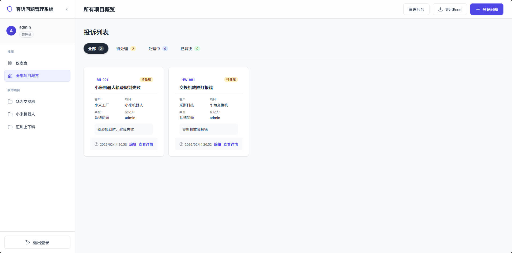
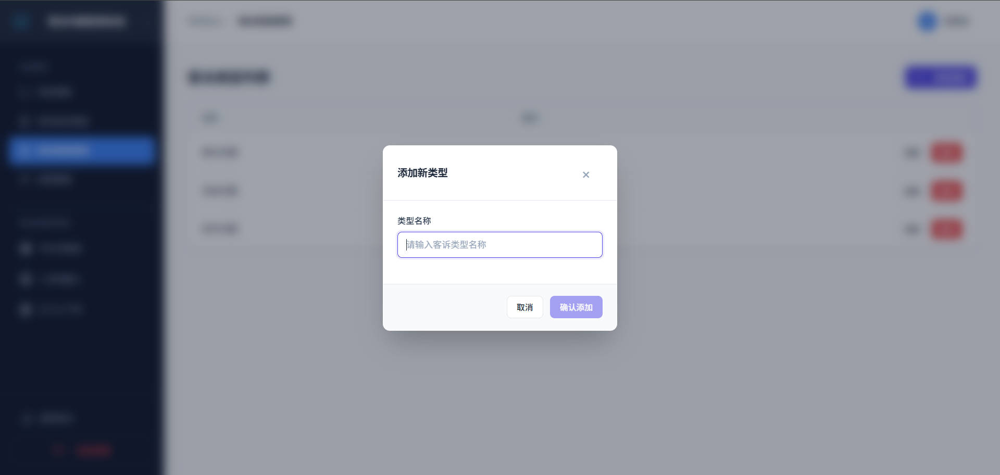
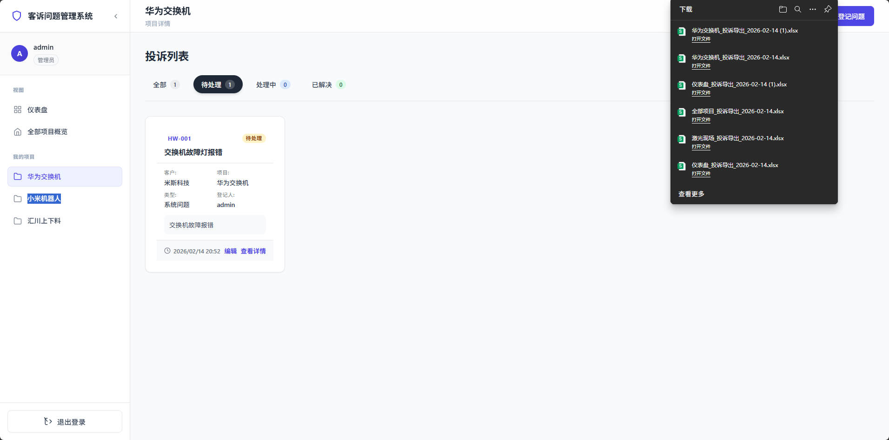
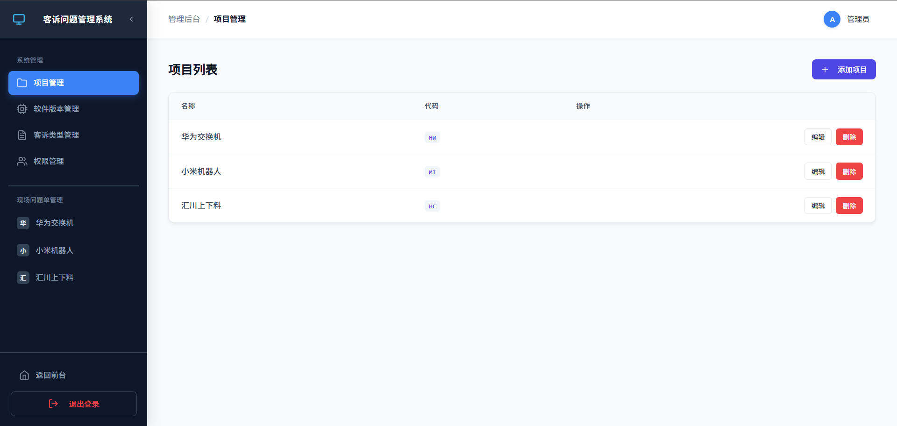
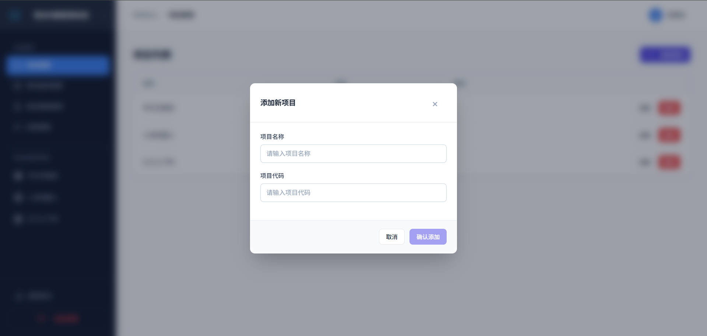
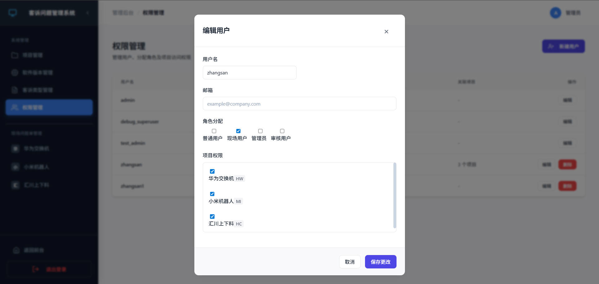
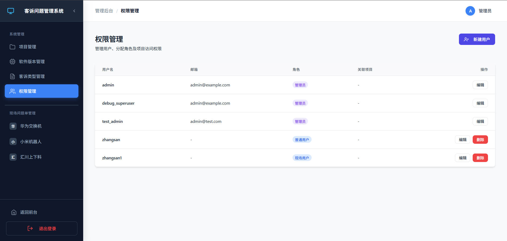

# 客户投诉管理系统 (Customer Complaint Management System)

这是一个基于 Django + Vue 3 的全栈客户投诉管理系统，旨在帮助团队高效地登记、追踪和解决客户反馈的问题。系统支持多角色协作、工单全生命周期管理以及数据统计分析。

## 🛠 技术栈

### 后端 (Backend)
- **语言**: Python 3.x
- **框架**: Django, Django REST Framework (DRF)
- **数据库**: SQLite (默认，可配置为 MySQL/PostgreSQL)
- **其他库**: 
  - `django-cors-headers` (跨域处理)
  - `pillow` (图片处理)
  - `openpyxl` (Excel 导出)

### 前端 (Frontend)
- **框架**: Vue 3 (Composition API)
- **构建工具**: Vite
- **路由**: Vue Router 4
- **HTTP 客户端**: Axios
- **UI 组件**: 自定义 CSS 样式 (非第三方组件库)
- **富文本编辑器**: @vueup/vue-quill
- **图表**: Chart.js, vue-chartjs

## ✨ 主要功能

### 1. 角色与权限 (RBAC)
系统内置多种角色，权限控制精确到按钮级：
- **管理员 (Admin)**: 拥有系统最高权限，管理项目、用户、工单及基础配置。
- **现场用户 (Field User)**: 
  - 主要负责**登记问题**。
  - **仅能查看和编辑自己提交的工单** (Row-Level Security)。
  - 在仪表盘可直接快速编辑工单。
- **审核用户 (Auditor)**: 负责工单的审核、状态流转（处理中/已解决）。
- **普通用户 (Project Member)**: 仅能查看所属项目的工单。

### 2. 工单管理
- **问题登记**: 支持标题、客户现场、项目关联、分类（软件/算法/系统）、富文本详细描述（支持截图粘贴）、附件上传。
- **状态追踪**: 待处理 -> 处理中 -> 已解决。
- **高级筛选**: 支持按状态、类型、登记人、客户现场、时间范围等多维度筛选。
- **Excel 导出**: 支持将筛选后的工单列表导出为 Excel 文件。

### 3. 协作与沟通
- **评论系统**: 工单详情页支持添加备注/评论，支持上传图片，方便技术人员与现场人员沟通。
- **版本管理**: 针对软件类问题，支持关联具体的软件版本号。

## � 系统截图 (Screenshots)

### 1. 前台操作 (Frontend Operations)
| 仪表盘 / 看板 | 全部工单概览 |
|:---:|:---:|
|  |  |

| 提交新问题 | 工单详情 |
|:---:|:---:|
|  |  |

| 提交表单 | 问题导出 |
|:---:|:---:|
|  |  |

### 2. 后台管理 (Admin Management)
| 项目管理 | 添加项目 |
|:---:|:---:|
|  |  |

| 用户管理 | 权限管理 |
|:---:|:---:|
|  |  |

## �🚀 安装与运行

### 环境要求
- Python 3.8+
- Node.js 16+

### 1. 后端设置 (Backend)

```bash
# 1. 进入后端目录
cd backend

# 2. 创建虚拟环境 (推荐)
python -m venv venv
# Windows 激活
..\venv\Scripts\activate
# Linux/Mac 激活
# source ../venv/bin/activate

# 3. 安装依赖
# 由于项目未提供 requirements.txt，请手动安装核心依赖：
pip install django djangorestframework django-cors-headers pillow openpyxl

# 4. 数据库迁移
python manage.py migrate

# 5. 初始化权限组 (重要！用于创建 Admin/Field/Auditor 等组)
python init_groups.py

# 6. 创建超级管理员
python manage.py createsuperuser

# 7. 启动服务器
python manage.py runserver
```

后端默认运行在 `http://127.0.0.1:8000`。

### 2. 前端设置 (Frontend)

```bash
# 1. 进入前端目录
cd frontend

# 2. 安装依赖
npm install

# 3. 启动开发服务器
npm run dev
```

前端默认运行在 `http://localhost:5173`。

## 📂 项目结构

```
root/
├── backend/                # Django 后端代码
│   ├── complaints/         # 核心业务 App (工单、项目、评论等)
│   ├── config/             # 项目配置 (settings.py, urls.py)
│   ├── media/              # 用户上传的文件 (图片、附件)
│   ├── manage.py           # Django 管理脚本
│   └── init_groups.py      # 权限组初始化脚本
├── frontend/               # Vue 3 前端代码
│   ├── src/
│   │   ├── components/     # 可复用组件 (ComplaintList, ComplaintForm 等)
│   │   ├── views/          # 页面视图 (Home, Login, ProjectComplaints 等)
│   │   ├── api.js          # Axios 接口封装
│   │   └── router/         # 路由配置
│   └── package.json
└── README.md               # 项目说明文档
```

## 📝 注意事项
- **图片上传**: 确保后端 `media/` 目录有写入权限。
- **跨域问题**: 开发环境下已配置 `django-cors-headers` 允许 `localhost:5173` 访问。
- **现场用户权限**: 现场用户登录后，在首页仪表盘仅能看到自己提交的工单，并可直接点击卡片上的“编辑”按钮进行修改。


# 创作不易
创作不易，感谢认可， 如若可以，打赏作者一杯奶茶      <br>
协助部署+技术支持 微X：UTF823  <br>

